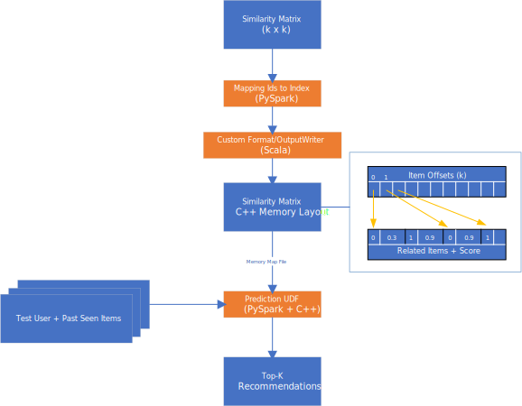

# sarplus (preview)
pronounced sUrplus as it's simply better if not best!

[](https://dev.azure.com/marcozo-sarplus/sarplus/_build/latest?definitionId=1)
[](https://badge.fury.io/py/pysarplus)

Features
* Scalable PySpark based [implementation](python/pysarplus/SARPlus.py)
* Fast C++ based [predictions](python/src/pysarplus.cpp)
* Reduced memory consumption: similarity matrix cached in-memory once per worker, shared accross python executors 
* Easy setup using [Spark Packages](https://spark-packages.org/package/eisber/sarplus)

# Benchmarks

| # Users | # Items | # Ratings | Runtime | Environment | Dataset | 
|---------|---------|-----------|---------|-------------|---------|
| 2.5mio  | 35k     | 100mio    | 1.3h    | Databricks, 8 workers, [Azure Standard DS3 v2](https://azure.microsoft.com/en-us/pricing/details/virtual-machines/linux/) | |

# Top-K Recommendation Optimization

There are a couple of key optimzations:

* map item ids (e.g. strings) to a continuous set of indexes to optmize storage and simplify access
* convert similarity matrix to exactly the representation the C++ component needs, thus enabling simple shared, memory mapping of the cache file and avoid parsing. This requires a customer formatter, written in Scala
* shared read-only memory mapping allows us to re-use the same memory from multiple python executors on the same worker node
* partition the input test users and past seen items by users, allowing for scale out
* perform as much of the work as possible in PySpark (way simpler)
* top-k computation
** reverse the join by summing reverse joining the users past seen items with any related items
** make sure to always just keep top-k items in-memory
** use standard join using binary search between users past seen items and the related items

 

# Usage

```python
import pandas as pd
from pysarplus import SARPlus

# spark dataframe with user/item/rating/optional timestamp tuples
train_df = spark.createDataFrame(
      pd.DataFrame({
        'user_id': [1, 1, 2, 3, 3],
        'item_id': [1, 2, 1, 1, 3],
        'rating':  [1, 1, 1, 1, 1],
    }))
   
# spark dataframe with user/item tuples
test_df = spark.createDataFrame(
      pd.DataFrame({
        'user_id': [1, 3],
        'item_id': [1, 3],
        'rating':  [1, 1],
    }))
    
model = SARPlus(spark, col_user='user_id', col_item='item_id', col_rating='rating', col_timestamp='timestamp')
model.fit(train_df, similarity_type='jaccard')

model.recommend_k_items(test_df, 'sarplus_cache', top_k=3).show()
```

## Jupyter Notebook

Insert this cell prior to the code above.

```python
import os

SUBMIT_ARGS = "--packages eisber:sarplus:0.2.2 pyspark-shell"
os.environ["PYSPARK_SUBMIT_ARGS"] = SUBMIT_ARGS

from pyspark.sql import SparkSession

spark = (
    SparkSession.builder.appName("sample")
    .master("local[*]")
    .config("memory", "1G")
    .config("spark.sql.shuffle.partitions", "1")
    .config("spark.sql.crossJoin.enabled", True)
    .config("spark.ui.enabled", False)
    .getOrCreate()
)
```

## PySpark Shell

```bash
pip install pysarplus
pyspark --packages eisber:sarplus:0.2.2 --conf spark.sql.crossJoin.enabled=true
```

## Databricks

One must set the crossJoin property to enable calculation of the similarity matrix (Clusters / &lt; Cluster &gt; / Configuration / Spark Config)

```
spark.sql.crossJoin.enabled true
```

1. Navigate to your workspace 
2. Create library
3. Under 'Source' select 'Maven Coordinate'
4. Enter 'eisber:sarplus:0.2.2'
5. Hit 'Create Library'
6. Attach to your cluster
7. Create 2nd library
8. Under 'Source' select 'Upload Python Egg or PyPI'
9. Enter 'pysarplus'
10. Hit 'Create Library'
11. Enter 'pysarplus'

This will install C++, Python and Scala code on your cluster.

# Packaging

For [databricks](https://databricks.com/) to properly install a [C++ extension](https://docs.python.org/3/extending/building.html), one must take a detour through [pypi](https://pypi.org/).
Use [twine](https://github.com/pypa/twine) to upload the package to [pypi](https://pypi.org/).

```bash
cd python

python setup.py sdist

twine upload dist/pysarplus-*.tar.gz
```

On [Spark](https://spark.apache.org/) one can install all 3 components (C++, Python, Scala) in one pass by creating a [Spark Package](https://spark-packages.org/). Documentation is rather sparse. Steps to install

1. Package and publish the [pip package](python/setup.py) (see above)
2. Package the [Spark package](scala/build.sbt), which includes the [Scala formatter](scala/src/main/scala/eisber/sarplus) and references the [pip package](scala/python/requirements.txt) (see below)
3. Upload the zipped Scala package to [Spark Package](https://spark-packages.org/) through a browser. [sbt spPublish](https://github.com/databricks/sbt-spark-package) has a few [issues](https://github.com/databricks/sbt-spark-package/issues/31) so it always fails for me. Don't use spPublishLocal as the packages are not created properly (names don't match up, [issue](https://github.com/databricks/sbt-spark-package/issues/17)) and furthermore fail to install if published to [Spark-Packages.org](https://spark-packages.org/).  

```bash
cd scala
sbt spPublish
```

# Testing

To test the python UDF + C++ backend

```bash
cd python 
python setup.py install && pytest -s tests/
```

To test the Scala formatter

```bash
cd scala
sbt test
```

(use ~test and it will automatically check for changes in source files, but not build.sbt)

